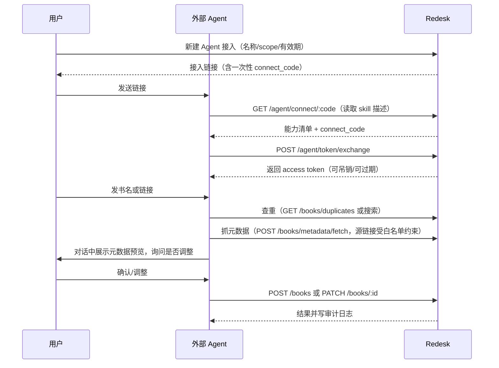

# 外部 Agent Skill 授权设计说明

> 本文是「外部 AI Agent 协助录入」功能的**落地版设计**（2026-08-16 重写）。早期草案中的实现细节（agent_clients / agent_grants / agent_pending_actions 三层建模等）已被下文按方案 A 的取舍替换。
>
> 一句话定位：用户在设置页生成「Agent 接入链接」发给外部 AI 代理；代理读取链接获得 skill 能力说明与一次性授权码，换取可吊销的访问令牌；随后按 scope 复用 Redesk 现有 API，在对话内确认后代用户录入、更新书籍。

---

## 1. 目标与非目标

### 1.1 目标

1. 用户在 Redesk 中生成一个「Agent 接入链接」。
2. 用户把链接发送给外部 AI Agent（ChatGPT / Claude / 豆包等）。
3. Agent 读取链接，获得 Redesk 的能力清单（skill 描述）与一次性授权码。
4. Agent 换发访问令牌后，按授权范围调用 Redesk API。
5. 用户发链接或书名给 Agent，Agent 负责查重、抓元数据、在对话中确认后录入/更新书籍。
6. 整个过程可吊销、可过期、可审计、可限流。

### 1.2 非目标（当前阶段不做）

- 不做「拿到链接即可无限制长期控制系统」——链接只是授权入口，不是长期凭据。
- 不做无审计的隐式后台写操作——所有写操作可追溯。
- 不做设置、用户、备份恢复、系统维护、文件上传/删除等权限对外开放。
- 不做让外部 agent 直接共享浏览器 session cookie。
- 不做笔记/主题相关操作（`notes:create`、`topics:create` 等留待后续版本）。
- 不做分类/标签的重命名与删除（v1 仅开放列表 + 新建）。

---

## 2. 端到端流程

```
① 设置页 → AI → Agent 接入：新建接入（名称 + 勾选 scope + 有效期）→ 生成链接
② 用户把链接发给 AI：让 AI 连接 Redesk 书架
③ AI 请求链接（GET /agent/connect/:code）→ 获得 skill 描述 + 一次性 connect_code
④ AI 用 code 换取 access token（POST /agent/token/exchange，code 一次性，默认 10 分钟过期）
⑤ 用户发书名/链接 → AI 查重 → 抓元数据 → 对话里展示并问「直接录入？调整分类/标签？」
   → 用户确认 → 调用创建 API
⑥ 更新已有书：AI 抓新元数据 → 展示字段 diff → 问「是否更新」→ 确认后应用
⑦ 用户随时可在设置页吊销接入、查看审计日志
```



---

## 3. 核心设计判断

### 3.1 链接不是权限本身，只是授权入口

用户发给 agent 的链接**不能等同长期访问凭据**。推荐模型：

- 链接只含一次性授权码（connect_code），默认 10 分钟失效，未完成授权前不可调用业务 API。
- 真正调用 API 的是授权完成后签发的 access token，可撤销、可过期、可审计。
- 链接可能被转发、缓存、截图，因此明文 token 绝不进链接。

### 3.2 外部 agent 与系统内置 AI 分离

- 系统内置 AI：系统内部能力，走 `AIService`，属于功能清单 §9。
- 外部 Agent AI：远程第三方代理，**单独建模**，不直接复用管理员权限，不自动获得内置 AI 的写权限。

### 3.3 确认机制采用「对话内确认」

本设计**不引入后端待确认动作表**（agent_pending_actions）。原因是：

- 用户的真实场景是「发书名给 AI，他负责添加」，期待轻量对话体验。
- 由 skill 文档约束 agent「写操作前必须先展示预览并征得用户同意」，后端用 scope + 字段白名单兜底。
- 所有写操作落 `audit_logs`，出问题可追溯、可吊销。

### 3.4 源链接必须过白名单（本次新增，含 SSRF 防护）

Agent 提交的外部源链接（元数据抓取入口、创建/更新时的 `source_url`）必须命中域名白名单，默认仅 `book.douban.com`（豆瓣读书）。理由：

- 保证元数据来源可信，防止 agent「随便找个信息源当源链接录入」。
- 顺带防 SSRF：阻止 agent 诱导服务端 `metadata/fetch` 抓取 `localhost`、内网 IP 等地址。
- 白名单可配置（settings 表），后续可按需放开 neodb.social 等。

---

## 4. 新增数据模型（3 张表）

### 4.1 `api_tokens` — 一个接入 = 一条令牌记录

| 字段 | 说明 |
| --- | --- |
| id | 主键 |
| owner_id | 归属用户，复用现有 owner 边界 |
| name | 接入名称（如「我的 Claude」） |
| token_hash | **只存 sha256 哈希**，明文 `rdk_live_...` 仅生成时返回一次 |
| scopes | JSON 数组，如 `["books:read","books:create"]` |
| expires_at | 过期时间（临时模式短 TTL，长期模式可设空） |
| last_used_at | 最近使用时间 |
| revoked_at | 吊销时间，非空即失效 |
| created_at | 创建时间 |

吊销 = 设置 `revoked_at`，即时生效，不需要删除记录（保留审计可追溯）。

### 4.2 `connect_codes` — 链接里的凭据

| 字段 | 说明 |
| --- | --- |
| id | 主键 |
| owner_id | 归属用户 |
| token_id | 指向被换发的 api_tokens 记录 |
| code_hash | **只存哈希** |
| expires_at | 默认 10 分钟 |
| used_at | 换发后立即标记，一次性使用 |

### 4.3 `audit_logs` — 审计日志

| 字段 | 说明 |
| --- | --- |
| id / owner_id | 归属与溯源 |
| token_id | 哪个接入干的 |
| request_id | 关联单次请求 |
| method / path | 请求方法路径 |
| action | 语义动作（如 `books.create` / `books.update`） |
| resource_type / resource_id | 目标对象 |
| result | success / denied / failed |
| ip / user_agent / created_at | 环境与时间 |

记录范围：所有 agent 写操作 + 被拒绝的请求（scope 不足、白名单外源链接等）。

### 4.4 为什么砍掉早期草案的 agent_clients / agent_grants / agent_pending_actions

- **agent_clients / agent_grants**：早期草案为「一个接入方多个授权关系」建模。本设计的现实场景是「一个接入 = 一个令牌」，`api_tokens.name` 已承担接入名称，吊销即断开，两层对象属于过度建模。
- **agent_pending_actions**：确认机制已选定「对话内确认」（见 3.3），不需要后端审批流。
- 若未来出现「一个 agent 多份授权、不同 scope 集合」的需求，再升级建模，不提前实现。

---

## 5. 鉴权层设计（改动集中在 auth.ts + 一个 preHandler）

### 5.1 Bearer token 解析

在 `apps/api/src/lib/auth.ts` 新增：

- `parseApiToken(req)`：读 `Authorization: Bearer rdk_...` → sha256 → 查 `api_tokens` → 校验未吊销、未过期 → 返回 `{ ownerId, scopes }`。
- 解析结果挂到 `req` 上（如 `req.apiIdentity`），现有路由的 `requireUserId` 优先读取它——**业务路由零改动**。

### 5.2 scope 白名单 preHandler（全局挂载）

- 请求带 Bearer token → 查 `ROUTE_SCOPE_MAP`（method + path 正则 → 所需 scope）：
  - 不在映射表内 → **403**；
  - 在映射表内 → 校验 token scopes 是否包含所需 scope，不满足 → 403 + 审计 denied。
- 请求带 session cookie → 走现有逻辑，完全不受影响。
- owner 边界：token 归属的 owner_id 直接进入现有 owner 校验链路，复用书籍/分类/标签的归属校验。

### 5.3 红线：以下路由不进白名单，agent 永久 403

- `settings`、`system`、`users`、`auth`、`backup`（如存在）、`files` 上传/替换/删除、`cloud-connections`、`storage`、`reader-fonts`（如需可后续评估）。
- 原则：**只放行 agent 明确需要的只读/新建能力，其余一律拒绝**。

---

## 6. skill 链接内容（`GET /agent/connect/:code`）

按 `Accept` 返回 HTML（给人看）或 JSON（给 agent 读）。JSON 结构：

```json
{
  "skill_version": 1,
  "name": "我的书架助手",
  "scopes": ["books:read", "books:create", "books:update_metadata"],
  "base_url": "https://redesk.example.com/api",
  "connect_code": "一次性授权码",
  "capabilities": [
    {
      "id": "search_books",
      "method": "GET",
      "path": "/books?q={query}",
      "requires_scope": "books:read",
      "description": "搜索书架，用于查重"
    },
    {
      "id": "fetch_metadata",
      "method": "POST",
      "path": "/books/metadata/fetch",
      "requires_scope": "books:read",
      "description": "从白名单源站（豆瓣读书）抓取元数据，只读不落库"
    },
    {
      "id": "create_book",
      "method": "POST",
      "path": "/books",
      "requires_scope": "books:create",
      "description": "新建书籍条目"
    },
    {
      "id": "apply_metadata",
      "method": "POST",
      "path": "/books/{id}/metadata/apply",
      "requires_scope": "books:update_metadata",
      "description": "把抓取结果应用到已有书"
    },
    {
      "id": "list_categories",
      "method": "GET",
      "path": "/categories",
      "requires_scope": "categories:manage"
    },
    {
      "id": "create_category",
      "method": "POST",
      "path": "/categories",
      "requires_scope": "categories:manage"
    },
    {
      "id": "list_tags",
      "method": "GET",
      "path": "/tags",
      "requires_scope": "tags:manage"
    },
    {
      "id": "create_tag",
      "method": "POST",
      "path": "/tags",
      "requires_scope": "tags:manage"
    }
  ],
  "conventions": [
    "创建或更新书籍前，必须先向用户展示元数据预览并询问是否调整，用户明确同意后才可执行写操作",
    "只通过本服务的 /books/metadata/fetch 抓取外部页面元数据，禁止自行请求外部网站",
    "源链接只允许豆瓣读书（book.douban.com），不得使用其他信息源链接",
    "创建前必须先用 search_books 做重复检测，发现疑似重复须先告知用户",
    "用户拒绝或说不必时，不要重试或纠缠",
    "只允许调用 capabilities 中列出的端点，其余一律禁止"
  ]
}
```

> `base_url` 取服务端配置的公开地址（env 配置，如 `REDESK_PUBLIC_URL`），未配置时回退用请求的 `Host` 头推导，保证链接在用户把链接发给远端 agent 时仍可访问。

---

## 7. 能力清单与 scope 映射（全部复用现有端点）

| 操作 | 端点 | scope | 备注 |
| --- | --- | --- | --- |
| 搜索书架 | `GET /books?q=` | books:read | 查重入口 |
| 书详情 | `GET /books/:id` | books:read | |
| 抓取元数据 | `POST /books/metadata/fetch` | books:read | 只读外部，不落库，源链接过白名单 |
| 新建书籍 | `POST /books` | books:create | 服务端强制重复检测提示 |
| 更新元数据 | `PATCH /books/:id` | books:update_metadata | 字段白名单（见 7.1） |
| 应用抓取结果 | `POST /books/:id/metadata/apply` | books:update_metadata | |
| 分类列表 | `GET /categories` | categories:manage | |
| 新建分类 | `POST /categories` | categories:manage | v1 不开放改名/删除 |
| 标签列表 | `GET /tags` | tags:manage | |
| 新建标签 | `POST /tags` | tags:manage | v1 不开放改名/删除 |

### 7.1 元数据更新字段白名单（agent 可改）

`title`、`author`、`subtitle`、`publisher`、`publish_year`、`description`、`source_url`、`translator`、`original_title`、`page_count`、`category_id`、`genre_category_id`、`tag_ids`、`entry_reason`

### 7.2 禁止 agent 修改/执行

- `owner_id`、`deleted_at`、状态流转、文件关联、封面二进制资源、系统内部状态字段。
- 删除书籍 / 删除分类 / 删除标签 / 重命名分类标签。
- 上传、替换、删除文件。
- 修改设置 / 用户 / 登录方式 / 备份恢复 / 系统维护 / 任意 SQL / 任意脚本。

---

## 8. 源链接白名单（后端强制）

### 8.1 校验入口

以下入口的 URL 当请求来自 agent token 时必须命中白名单，否则 403 + 审计 denied：

| 入口 | 字段 |
| --- | --- |
| `POST /books/metadata/fetch` | `url` |
| `POST /books`（新建） | `source_url` |
| `PATCH /books/:id` / `POST /books/:id/metadata/apply`（更新） | `source_url` |

### 8.2 默认值与配置

- 默认白名单：`book.douban.com`（豆瓣读书）。
- 设置项：settings 表新增 key（如 `agent_source_url_whitelist`），默认 `["book.douban.com"]`，设置页可编辑。
- 校验规则：解析 URL → 协议必须 http/https → host 命中白名单项或为其子域（`host === item || host.endsWith('.' + item)`）→ 否则拒绝。

### 8.3 与 Web 端的关系

白名单**只在 agent 请求边界强制执行**，浏览器录入保持现有行为（任意链接可粘贴，豆瓣/neodb 深解析、其他站退化为 og:meta 通用解析）。

---

## 9. 书名-only 录入的处理

- **约定（v1 方案）**：用户只给书名时，AI 用**自身的联网搜索**找到豆瓣读书页面链接，再调 Redesk 的 `metadata/fetch` 抓取。Redesk **不新增服务端外部搜索**，反爬面保持不变，且源链接依然过白名单。
- 前提约束：所选 AI 平台自带联网搜索能力；若平台无此能力，后续版本再评估新增 `POST /books/metadata/search` 服务端搜索端点（走 `fetch-utils` 限速与反爬策略）。

---

## 10. 前端界面（设置页 AI Tab 新增「Agent 接入」分区）

- **区块 A 已连接 Agent**：名称 / scope 徽章 / 有效期 / 最近使用时间 / 吊销按钮。
- **区块 B 新建接入**：名称、scope 勾选、有效期（临时/长期）→ 生成链接（一次性展示授权码，复制按钮）。
- **区块 C 审计日志**：时间 / Agent / 操作 / 结果 / 目标对象。

---

## 11. 安全约束与速率限制

### 11.1 必须项

- token 与 connect_code 只存哈希，不存明文。
- connect_code 一次性使用，默认 10 分钟过期。
- 支持立即吊销（设置 `revoked_at`）。
- 所有 agent 写操作与被拒请求写审计日志。
- 源链接域名白名单（见 §8）。
- 中风险写操作依赖对话内确认（见 §3.3 与 §6 conventions + scope 兜底）。

### 11.2 明确不采用

- 不把长期 Bearer token 拼在 URL 参数里。
- 不让外部 agent 继承浏览器登录态。
- 不允许 agent 自声明 scope 或越权调用非白名单路由。

### 11.3 速率限制（v1 默认）

- 读取：60 次 / 分钟 / token。
- 写入：10 次 / 分钟 / token。

---

## 12. 实施顺序

### Phase 1：核心链路

1. 新增 3 张表（api_tokens / connect_codes / audit_logs）+ 新 migration（遵守迁移红线：只新增，不改已应用 SQL）。
2. `auth.ts` 新增 Bearer token 解析（`parseApiToken` / `requireApiToken`）。
3. 全局 scope 白名单 preHandler + `ROUTE_SCOPE_MAP`。
4. `GET /agent/connect/:code`（skill 描述 HTML/JSON）+ `POST /agent/token/exchange`。
5. 源链接白名单校验（settings key + 校验函数，agent 请求边界生效）。
6. 设置页「Agent 接入」分区（接入管理 + 生成链接 + 吊销）。
7. skill 描述定稿。

结果：外部 agent 已可安全完成「查重 → 抓元数据 → 对话确认 → 录入/更新书籍」。

### Phase 2：审计与限流

- `audit_logs` 记录完善（含 denied 请求）。
- 按 token 速率限制。
- 设置页审计日志列表。

### Phase 3：可选增强

- MCP server 封装（复用同一组 API 与鉴权）。
- `POST /books/metadata/search` 服务端搜索（需评估反爬）。
- 分类/标签重命名、笔记/主题操作（按需放开 scope）。

每阶段完成跑 `pnpm typecheck`、`pnpm lint`，并用空库 `db:migrate` 演练；旧库升级走新增 migration，不触碰已应用迁移。

---

## 13. 与现有文档的关系

- `doc/Redesk-功能清单-v1.1.md`：§8 第三方集成新增 8.09–8.12（Agent 接入管理 / skill 链接与令牌交换 / 操作审计日志 / 源链接白名单）。
- `doc/技术方案.md`：新增 §4.7 外部 Agent 接入小节，并登记风险行。
- 本设计与《需求总纲》《决策记录》不冲突；属于新增强能力，开发前如需在《决策记录》登记结论，按该文档流程补充。

---

## 14. 遗留决策（后续版本确认）

- 是否开放分类/标签重命名、删除（当前 v1 不开放）。
- 是否开放笔记/主题操作 scope。
- 是否提供服务端书名搜索端点。
- 是否提供 MCP 封装。
