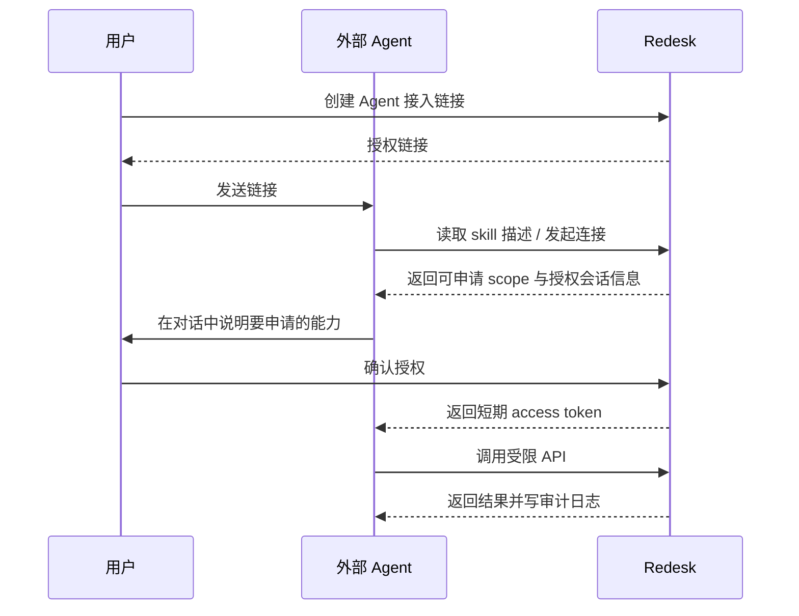

# 外部 Agent Skill 授权设计说明

## 1. 文档定位

本文定义 Redesk 面向外部 AI Agent 的 `skill` 授权能力，目标是让用户把一个 Redesk 授权链接交给外部 agent 后，agent 可以在与用户对话的过程中请求授权，并在被允许的边界内代用户操作 Redesk 内容。

本文只讨论：

- 外部 agent 如何接入 Redesk
- 链接授权如何建立
- 授权后的权限边界如何控制
- 哪些操作允许 agent 执行
- 哪些操作必须再次确认

本文不直接替代既有《需求总纲》《决策记录》《API 接口》，而是作为实现前的专项设计说明。

---

## 2. 目标与非目标

### 2.1 目标

实现一条完整链路：

1. 用户在 Redesk 中生成一个“Agent 接入链接”。
2. 用户把该链接发送给外部 AI Agent。
3. Agent 读取链接提供的接入描述，知道 Redesk 支持哪些能力。
4. Agent 在与用户对话时，按需发起“查看 / 新建 / 修改”请求。
5. Redesk 按授权范围决定：
   - 可直接执行；
   - 需用户确认后执行；
   - 明确拒绝执行。
6. 整个过程可审计、可吊销、可限流、可追溯。

### 2.2 非目标

当前阶段不做以下内容：

- 不做“拿到链接即可无限制长期控制系统”
- 不做无审计的隐式后台操作
- 不做开放式文件系统访问
- 不做设置、用户、备份恢复、系统维护权限对外开放
- 不做让外部 agent 直接共享 session cookie

---

## 3. 当前现状

当前代码状态：

- `apps/api/src/lib/auth.ts` 只有 session / admin / permission 体系，没有 Bearer token 鉴权。
- `packages/db/src/schema/` 中尚无 `api_tokens`、`audit_logs`、`agent_grants` 相关表。
- `apps/web/src/routes/settings/ai-tab.tsx` 目前只有 LLM provider / model / key 配置，没有外部 agent 管理界面。

现有文档状态：

- `doc/todo/M1-书架功能优化.md` 已明确“外部 Agent AI”方向。
- 已确定基础原则：外部 agent 默认应以 `只读 + 创建` 为起点，不能直接拿到高风险写权限。

结论：

- Redesk 已有方向，但还没有可用的授权链路实现。
- 如果直接把“长期 token 明文”塞进链接里，安全边界过低，不应采用。

---

## 4. 核心设计判断

### 4.1 链接不是权限本身，只是授权入口

用户发给 agent 的链接，不能等同于长期访问凭据。

推荐模型：

- 链接只用于启动一次授权会话；
- 真正可调用 API 的是授权完成后签发的 access token；
- access token 必须可撤销、可过期、可审计。

这样做的原因：

- 链接可能被转发、缓存、截图；
- 外部 agent 平台通常不是完全可信执行环境；
- 后续必须支持“断开这个 agent”“缩小权限”“查看它干过什么”。

### 4.2 外部 agent 权限不能直接等同系统内置 AI

Redesk 已经区分：

- 系统内置 AI：系统内部能力，未来走 `AIService`
- 外部 Agent AI：远程第三方代理

外部 agent 必须单独建模，不能直接复用管理员权限，也不能自动拥有系统内置 AI 后续可能拥有的写权限。

### 4.3 “可授权操作”必须分层

不是简单的“能做 / 不能做”，而应分成三层：

1. 低风险：可直接执行
2. 中风险：需单次确认
3. 高风险：当前阶段禁止

这样用户才能在对话里自然授权，而不是每一步都去设置页改配置。

---

## 5. 推荐能力边界

### 5.1 第一阶段允许的能力

建议第一阶段开放以下 scope：

| Scope | 能力 | 风险级别 | 默认 |
| --- | --- | --- | --- |
| `books:read` | 查看书架、搜索书籍、查看书籍详情 | 低 | 开 |
| `books:create` | 新建书籍条目 | 低 | 开 |
| `books:update_metadata` | 修改已有书籍的元数据字段 | 中 | 关 |
| `notes:create` | 新建独立笔记 | 中 | 关 |
| `topics:create` | 新建主题 | 中 | 关 |
| `topics:link` | 把书 / 高亮 / 笔记加入主题 | 中 | 关 |

### 5.2 第一阶段禁止的能力

| 能力 | 原因 |
| --- | --- |
| 删除书籍 / 删除笔记 / 删除主题 | 破坏性强 |
| 上传文件 / 替换文件 / 删除文件 | 涉及存储与内容资产 |
| 修改设置 / 用户 / 登录方式 | 系统级风险 |
| 备份 / 恢复 / 清缓存 / 重建索引 | 管理员能力 |
| 任意 SQL / 任意脚本 / 任意路径访问 | 越权风险过高 |

### 5.3 元数据修改的字段限制

即便开放 `books:update_metadata`，也应限制为可白名单更新字段：

- `title`
- `author`
- `subtitle`
- `publisher`
- `publish_year`
- `description`
- `source_url`
- `translator`
- `original_title`
- `page_count`
- `category_id`
- `genre_category_id`
- `tag_ids`
- `entry_reason`

不允许通过外部 agent 修改：

- `owner_id`
- `deleted_at`
- 文件关联
- 封面二进制资源
- 系统内部状态字段

---

## 6. 总体授权模型

### 6.1 三层对象

建议引入三类对象：

1. `agent_clients`
   - 表示一个外部 agent 接入方
   - 例如“我的 ChatGPT Agent”“我的 Claude Agent”

2. `agent_grants`
   - 表示某次授权关系
   - 记录授予了哪些 scope、是否允许修改、是否需要逐次确认

3. `api_tokens`
   - 真正调用 API 的凭据
   - 由 grant 派生，短期或长期存在

关系：

- 一个 `agent_client` 可以有多个 `agent_grant`
- 一个 `agent_grant` 可以签发一个或多个 `api_token`

### 6.2 推荐授权模式

建议支持两种模式：

#### 模式 A：长期受限授权

- 用户明确把某个 agent 连接到 Redesk
- scope 固定
- 可长期使用
- 适合“我的固定 AI 助手”

#### 模式 B：会话内临时授权

- 仅针对某次对话/某个任务
- TTL 很短，例如 30 分钟或 24 小时
- 适合“这次帮我整理书架”“这次帮我补元数据”

默认推荐模式 B，长期模式由用户显式开启。

---

## 7. 链接授权流程

### 7.1 用户视角流程

1. 用户在设置页点击“新建 Agent 接入”。
2. Redesk 生成一个授权链接。
3. 用户把链接发给外部 AI Agent。
4. Agent 告诉用户：“我可以连接你的 Redesk，请确认授权范围。”
5. 用户同意后，Redesk 创建 grant 并向 agent 签发 token。
6. Agent 后续即可按 scope 调用 Redesk。

### 7.2 系统视角流程

### 7.3 链接内容建议

链接本身不应包含明文 token。

建议形式：

`https://{redesk-host}/agent/connect/{connect_code}`

其中：

- `connect_code` 是一次性或短时有效码
- 默认 10 分钟失效
- 未完成授权前不可调用业务 API

---

## 8. “对话中授权”的实现方式

### 8.1 两种确认层级

对话中授权需要拆成两个层级：

#### 层级 1：接入授权

确认 agent 是否可以连接此 Redesk。

确认项：

- agent 名称
- 授权有效期
- scope 范围
- 是否允许自动执行低风险写操作

#### 层级 2：操作授权

当 agent 真的要执行中风险动作时，再确认具体动作。

例如：

- “把《XXX》的作者改成 YYY”
- “把这 3 本书加入‘待读’分类”
- “为这本书新建一条笔记”

### 8.2 操作授权的决策规则

建议规则：

- `books:read`：直接执行
- `books:create`：可直接执行，但必须做重复检测
- `books:update_metadata`：默认需单次确认
- `notes:create` / `topics:create` / `topics:link`：默认需单次确认

这样可以满足“通过与 agent 对话授权他操作一些内容”，同时不把系统变成默认可写。

### 8.3 为什么不建议“只要 scope 有写权限就静默执行”

因为外部 agent 的行为强依赖提示词与上下文，容易出现：

- 理解偏差
- 误改对象
- 连续误操作
- 用户在对话里表达模糊时越权行动

因此，中风险写操作建议保留 `pending_action -> user_confirmed -> execute` 流程。

---

## 9. 数据模型建议

### 9.1 `api_tokens`

沿用既有文档方案：

- `id`
- `owner_id`
- `name`
- `token_hash`
- `scopes`
- `last_used_at`
- `created_at`
- `revoked_at`

补充建议字段：

- `grant_id`：来源授权关系
- `expires_at`：过期时间
- `token_type`：`agent_long_lived` / `agent_session`

### 9.2 `audit_logs`

沿用既有方案：

- `id`
- `owner_id`
- `token_id`
- `action`
- `resource_type`
- `resource_id`
- `ip`
- `user_agent`
- `created_at`

补充建议字段：

- `request_id`
- `result`
- `diff_summary`
- `confirmed_by_user`

### 9.3 `agent_clients`

建议新增：

- `id`
- `owner_id`
- `name`
- `provider`
- `description`
- `created_at`
- `updated_at`
- `revoked_at`

### 9.4 `agent_grants`

建议新增：

- `id`
- `owner_id`
- `agent_client_id`
- `grant_mode`：`session` / `persistent`
- `scopes`
- `require_confirmation_scopes`
- `issued_at`
- `expires_at`
- `revoked_at`

### 9.5 `agent_pending_actions`

如果要做“对话中二次确认”，建议新增：

- `id`
- `owner_id`
- `grant_id`
- `action_type`
- `resource_type`
- `resource_id`
- `payload_json`
- `status`：`pending` / `approved` / `rejected` / `expired` / `executed`
- `created_at`
- `decided_at`
- `expires_at`

---

## 10. API 设计建议

### 10.1 接入与授权

- `POST /agent/connect-sessions`
  - 创建一个接入链接
- `GET /agent/connect/:code`
  - 返回该链接可用的 skill 描述与授权会话信息
- `POST /agent/connect/:code/approve`
  - 用户确认接入授权
- `POST /agent/token/exchange`
  - 用 connect session 或 grant 换 access token

### 10.2 Token / Grant 管理

- `GET /agent/clients`
- `POST /agent/clients`
- `GET /agent/grants`
- `POST /agent/grants/:id/revoke`
- `GET /agent/tokens`
- `POST /agent/tokens/:id/revoke`

### 10.3 待确认动作

- `GET /agent/pending-actions`
- `POST /agent/pending-actions/:id/approve`
- `POST /agent/pending-actions/:id/reject`

### 10.4 业务调用

业务 API 不建议单独复制一套 `/agent/books`。

推荐：

- 继续复用现有 `/books`、`/topics`、`/notes`
- 在鉴权层识别当前请求是否来自 agent token
- 再做 scope、字段白名单、确认态检查

理由：

- 减少重复接口
- 保持业务逻辑只有一套
- 后续 Web、自带 AI、外部 agent 更容易共享规则

---

## 11. 前端界面建议

### 11.1 设置页新增「Agent 授权」分区

建议放在设置页 `AI` Tab 下，而不是散落到 `登录管理`。

原因：

- 这是 AI 接入能力，不是用户登录方式
- 用户心智是“管理我的 AI 助手”，不是“管理账户登录”

### 11.2 页面结构

#### 区块 A：已连接 Agent

- Agent 名称
- 提供方
- 授权范围
- 最近使用时间
- 有效期
- 吊销按钮

#### 区块 B：新建接入链接

- 链接用途名称
- 授权模式：临时 / 长期
- 勾选 scope
- 中风险动作是否需要逐次确认
- 生成链接

#### 区块 C：待确认操作

- 待办列表
- 显示 agent、动作、目标对象、变更摘要
- `批准` / `拒绝`

#### 区块 D：审计日志

- 时间
- Agent
- 操作
- 结果
- 目标对象

---

## 12. 安全约束

### 12.1 必须做的安全项

- token 只存哈希，不存明文
- 链接码短期有效且一次性
- 支持立即吊销
- 按 token 限流
- 所有写操作写审计日志
- agent 创建书籍强制重复检测
- 中风险写操作保留确认链路

### 12.2 明确不采用的方案

- 不把长期 Bearer token 拼在 URL 参数里
- 不让外部 agent 继承浏览器登录态
- 不允许 agent 通过 prompt 拼任意接口路径越权调用
- 不允许 agent 自声明 scope

### 12.3 速率限制建议

第一阶段建议默认：

- 读取：60 次 / 分钟 / token
- 写入：10 次 / 分钟 / token
- 待确认动作创建：20 次 / 小时 / grant

---

## 13. 与现有文档的关系

本文与既有方向一致：

- 延续 `doc/todo/M1-书架功能优化.md` 的“外部 agent 单独建模”
- 延续 `只读 + 创建` 的保守默认值
- 在此基础上新增“链接式接入”和“对话中的单次授权”两层机制

本文对既有方案的主要补充：

1. 增加“链接不是 token，只是授权入口”的约束。
2. 增加 `agent_clients / agent_grants / agent_pending_actions` 三层建模。
3. 增加“对话里授权具体操作”的确认机制。

---

## 14. 推荐实施顺序

### Phase 1：基础接入

- 新增 `api_tokens`
- 新增 `audit_logs`
- Bearer token 鉴权
- scope 校验
- 设置页 Token 管理

结果：

- 外部 agent 已可安全只读 / 创建
- 但还没有“链接授权”和“操作待确认”

### Phase 2：链接授权

- 新增 `agent_clients`
- 新增 `agent_grants`
- 新增 connect session / token exchange API
- 设置页生成接入链接

结果：

- 用户可以把接入链接发给 agent
- agent 可建立正式连接

### Phase 3：对话中的操作授权

- 新增 `agent_pending_actions`
- 中风险写操作改为待确认流
- 设置页 / 通知中心增加批准与拒绝入口

结果：

- 真正实现“通过与 agent 对话授权他帮我操作一些内容”

---

## 15. 推荐结论

如果要做你说的能力，推荐按下面的原则落地：

1. 先做外部 agent 的独立鉴权，不复用 session。
2. 用户发给 agent 的是授权链接，不是长期 token。
3. 默认只开 `books:read` + `books:create`。
4. 修改已有内容必须进入“待确认动作”。
5. 所有 agent 写操作必须可审计、可撤销、可限流。

这条路线比“直接给 agent 一个万能 token”慢一点，但符合 Redesk 当前的安全边界，也更适合后续长期维护。

---

## 16. 待你确认的关键点

实现前还需要你拍板 3 件事：

1. 第一阶段是否允许 `books:update_metadata`
2. “待确认动作”是做在设置页，还是额外做一个全局通知入口
3. 接入目标是否只面向“固定几个 agent 平台”，还是做通用 skill / MCP 风格接入
